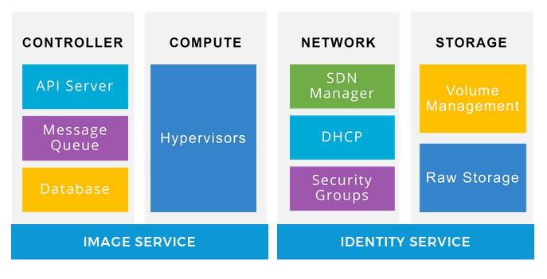

# Infrastructure Security for Cloud

1. [Introduction to Infrastructure Security for Cloud Computing](#introduction-to-infrastructure-security-for-cloud-computing)
2. [Software Defined Network](#software-defined-network)
3. [Cloud Network Security](#cloud-network-security)
4. [Securing Compute Workloads](#securing-compute-workloads)
5. [Management Plane Security](#management-plane-security)
6. [Business Continuity & Disaster Recovery](#business-continuity--disaster-recovery)

## Introduction to Infrastructure Security for Cloud Computing

* Macro layers (bottom to top) - Base Infra, Virtualized Infra, and Management Plane.

* Cloud security broadly covers components such as infra, hypervisors, network and management plane. Its advantages include:

  * Reduced capital expenditure
  * Better agility, resiliency
  * Better economic and security benefits

* Simplified Infrastructure Components:

* Securing cloud infrastructure:

  * Harden hosts
  * Harden infra services
  * Secure networks
  * Secure architecture
  * Harden management plane

## Software Defined Network

## Cloud Network Security

## Securing Compute Workloads

## Management Plane Security

## Business Continuity & Disaster Recovery
