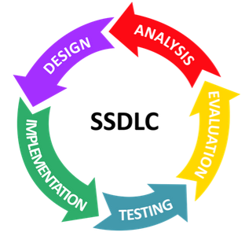
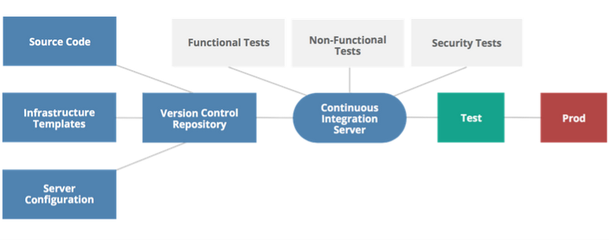

# Securing Cloud Applications, Users & Related Technologies

1. [Secure Software Development Lifecycle (SSDLC)](#secure-software-development-lifecycle-ssdlc)
2. [Testing & Assessment](#testing--assessment)
3. [DevOps & Immutable](#devops--immutable)
4. [Secure Operations, Architecture & Related Technologies](#secure-operations-architecture--related-technologies)
5. [Identity & Access Management (IAM) Definitions](#identity--access-management-iam-definitions)
6. [Identity & Access Management (IAM) Standards](#identity--access-management-iam-standards)
7. [Identity & Access Management (IAM) in Practice](#identity--access-management-iam-in-practice)

## Secure Software Development Lifecycle (SSDLC)

* How Cloud changes AppSec:

  * Opportunities:

    * Higher baseline security
    * Agility
    * Isolated environments
    * Independent VMs for microservices
    * Elasticity
    * DevOps
    * Unified interface

  * Challenges:

    * Limited visibility
    * Increased app scope
    * Changing threat models
    * Reduced transparency

* AppSec phases:

  * Secure Design & Development - training, SSDLC, pre-deploy testing

  * Secure Deployment - code review, testing, vulnerability assessment, deployment

  * Secure Operation - change management, app defenses, ongoing assessment, activity monitoring

* SSDLC framework:

* Impact of cloud on SSDLC:

  * Risks change; more support from cloud provider

  * Large changes in visibility & control

  * Management plane and metastructure part of threat model

  * DevOps; managed via APIs

* Secure Design & Development:

* Threat modeling is done to get a view of all possible threats; one example is STRIDE (Spoofing, Tampering, Repudiation, Information Disclosure, Denial of Service, Elevation of Privilege). The threat models are later mapped to their countermeasures.

## Testing & Assessment

* Testing is not isolated to secure development or secure deployment, these testing phases overlap.

* Secure Development & Testing - the implementation of tests changes in cloud:

  * Code review - manual; encompasses cloud APIs for API calls
  
  * Static analysis testing - SAST (static appsec testing); checks for cloud creds, API calls

  * Unit, regression, functional testing - standard testing; to test for security functions

* Secure Deployment & Testing - vulnerability assessment, penetration testing & dynamic analysis:

  * cloud-specific tools and features to be used

  * developers and cloud admins should be included in scope of penetration tests

  * allow pentesters authorized access to break isolation

* Vulnerability Assessment in Cloud:

  * Test images in pipeline
  * Use host-based agent
  * Traditional network assessment (with permission)

## DevOps & Immutable

* DevOps - technical process around continuous integration/delivery and automation.

* Security benefits of DevOps:

  * Greater standardization
  * Automated testing
  * Improved auditing
  * Leverage automation to improve security operations

* DevOps and Continuous Integration:

* Immutable & Infrastructure as Code (IaC) - infra stack, VMs and containers defined in templates in version controls; environments rebuilt based on updated config. Easy to rebuild/rollback environment.

* Security benefits of IaC - consistency, control, auditability.

## Secure Operations, Architecture & Related Technologies

* Secure operations:

  * After app is deployed and running in cloud

  * Focus on management plane

  * Monitor for changes in environment

  * Do not neglect ongoing testing

  * Cloud config within scope of change management

  * WAF (web app firewall) must auto-scale, embedded in workload or cloud-hosted

* Impact of cloud on app design and architecture:

  * Segregation by default

  * Immutable infra

  * Increased use of microservices

  * PaaS and serverless

* PaaS/Serverless and Security:

  * Provider takes on more security responsibilities

  * Communicating via API on provider's platform reduces network attack paths

  * Enables software-defined security

  * May enable event-driven security

* App Security recommendations:

  * Understand security capabilities of cloud providers

  * Build security into initial design process

  * Consider moving to continuous deployment and automating security into deployment pipeline

  * Threat modeling, SAST and DAST should be integrated

  * Understand new architectural options and requirements in cloud

  * Update security policies and standards

  * Integrate security testing into deployment process

  * Use software-defined security and event-driven security to automate security controls and detection of issues

  * Use different cloud environments to segregate management plane access

## Identity & Access Management (IAM) Definitions

## Identity & Access Management (IAM) Standards

## Identity & Access Management (IAM) in Practice
